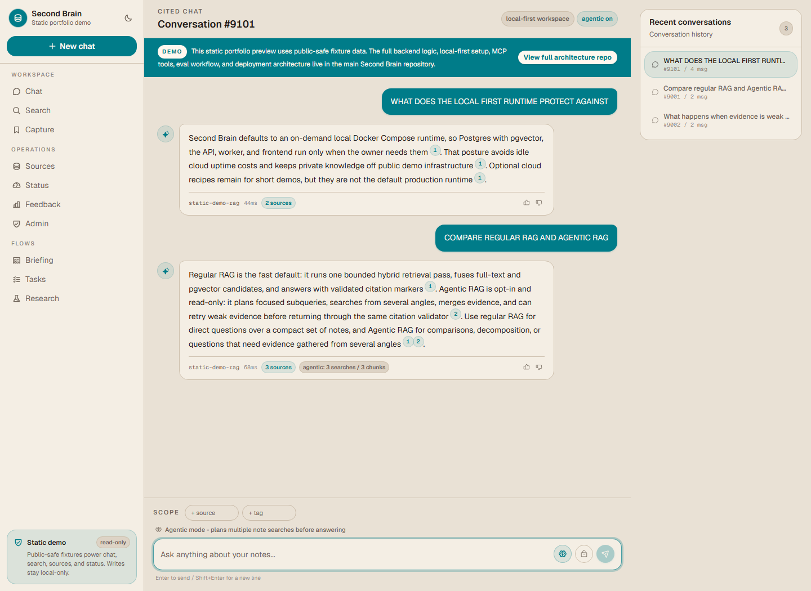

# Second Brain Portfolio Demo

**A zero-cost static Netlify portfolio preview of
[Second Brain](https://github.com/tomnguyen103/second-brain): a local-first
personal AI workspace for streaming cited RAG, hybrid search, source
management, briefings, feedback/evals, and MCP-powered actions.**

This repository keeps the public demo separate from the full local-first
runtime. It ships only static frontend assets and public-safe fixture data, so
portfolio visitors can click through the product experience without deploying a
database, API server, worker, LLM key, or private notes.



## Important Note

This repo is only the static portfolio demo. The actual logic code, backend
architecture, local-first setup, MCP tools, eval workflow, worker, database, and
operations documentation live in the main repository:

https://github.com/tomnguyen103/second-brain

Use this repo to review the deployable public frontend experience. Use the main
`second-brain` repo to review how the full system is built, operated, tested,
and extended.

## Project Overview

The full Second Brain project captures web passages and personal knowledge,
stores them in PostgreSQL with pgvector and full-text indexes, serves
citation-validated answers over streaming chat, produces briefings, and exposes
MCP tools for trusted local clients.

This static demo mirrors the portfolio-facing web shell with deterministic,
browser-side fixture behavior. Chat, search, sources, status, feedback, tasks,
research, briefing, and admin pages call a read-only demo adapter backed by the
public demo corpus. Regular RAG and Agentic RAG are both represented with
citation markers, retrieval metadata, source snippets, and a clear demo-context
notice that links viewers to the full architecture repo.

## Tech Stack

| Layer | Static portfolio demo | Full `second-brain` repo |
| --- | --- | --- |
| Frontend | Next.js 16 static export, React 19, TypeScript, Tailwind CSS, Base UI/shadcn-style primitives, TanStack Query, Framer Motion, Phosphor/lucide icons | Next.js, TypeScript, Tailwind CSS, shadcn/ui, TanStack Query, repo-local WattVision DesignMD |
| Demo API | Browser-side read-only adapter in `frontend/lib/api/demo-client.ts` | Python, FastAPI, SQLAlchemy, Alembic, Pydantic v2 |
| Data and retrieval | Public-safe fixture corpus, deterministic static search, local citation helpers | PostgreSQL, pgvector, full-text search, JSONB, RLS, audit tables, RRF hybrid retrieval |
| Agentic RAG | Static Agentic RAG metadata and deterministic comparison answers | LangGraph request-scoped read-only retrieval workflow |
| LLM and embeddings | No browser LLM calls, no embedding API calls, no secrets | Gemini 2.5 Flash, local Ollama private mode, fake driver, MiniLM or Gemini embeddings |
| Workflows | Read-only UI surfaces for writes, ingest, eval promotion, retention purge, and admin actions | MCP stdio tools, durable worker jobs, daily briefings, feedback review, MLflow evals, CI eval gate |
| Runtime and deploy | Netlify static export from `frontend/out`; zero backend cost | Local-first Docker Compose with optional VPS demo recipe and local kind learning track |

## What This Demo Shows

- Clickable Second Brain web shell with chat, search, sources, status,
  feedback, tasks, research, briefing, and admin surfaces.
- Public-safe fixture corpus for regular RAG and Agentic RAG prompts.
- Deterministic cited answers with citation markers and source snippets.
- Static search over the public demo corpus.
- Read-only behavior for writes such as capture, ingest, task creation,
  source edits, research enqueue, eval promotion, deletion, and retention purge.
- A highlighted demo context notice that tells viewers this is a static
  portfolio preview and links to the full architecture repo.
- Optional casual passcode gate through `NEXT_PUBLIC_DEMO_ACCESS_HASH`.

## What This Repo Does Not Contain

This repository intentionally does not include:

- FastAPI backend services
- PostgreSQL, pgvector, Redis, or worker runtime
- Gemini, Ollama, or embedding API calls
- Private notes, raw transcripts, uploaded files, or local runtime state
- Admin tokens, API tokens, database URLs, `.env` files, or secrets
- Durable write or ingest workflows

Only public-safe fixture data belongs in this static demo.

## Project Shape

```text
frontend/                         Static-exportable Next.js app
frontend/lib/demo/public-demo-data.ts
                                  Public-safe fixture corpus
frontend/lib/api/demo-client.ts    Browser-side read-only API adapter
frontend/lib/demo/static-search.ts Static search and citation helpers
docs/portfolio-demo-netlify.md     Netlify runbook
docs/assets/                       README screenshots
netlify.toml                       Static Netlify build settings
```

## Netlify Setup

Connect Netlify to this repository and keep the committed `netlify.toml`
settings:

```toml
[build]
base = "frontend"
command = "npm ci && npm run build"
publish = "out"
```

The static demo build environment is already declared in `netlify.toml`:

```text
NEXT_PUBLIC_SECOND_BRAIN_DEMO_MODE=static
NEXT_PUBLIC_AGENTIC_RAG_ENABLED=true
NEXT_TELEMETRY_DISABLED=1
```

Optional casual access gate:

```text
NEXT_PUBLIC_DEMO_ACCESS_HASH=<lowercase sha256 hash of your demo passcode>
```

`NEXT_PUBLIC_DEMO_ACCESS_HASH` is shipped to the browser because this is a
static site. It is useful for casual access control, but it is not a security
boundary.

Do not add backend secrets or runtime variables to Netlify for this repo:

```text
DATABASE_URL
SECOND_BRAIN_API_TOKEN
SECOND_BRAIN_ADMIN_TOKEN
GEMINI_API_KEY
SECOND_BRAIN_TEST_DATABASE_URL
```

## Local Verification

From `frontend/`:

```powershell
npm ci
npm run lint
$env:NEXT_PUBLIC_SECOND_BRAIN_DEMO_MODE="static"
$env:NEXT_PUBLIC_AGENTIC_RAG_ENABLED="true"
npm run build
python -m http.server 4173 --directory out --bind 127.0.0.1
```

Open:

```text
http://127.0.0.1:4173/chat/
```

Check that:

- `/chat/` shows the highlighted demo context notice and answers public-safe
  prompts with citations.
- The Agentic RAG toggle updates the header state and returns static agentic
  retrieval metadata when enabled.
- `/search/` returns fixture corpus hits.
- `/sources/` shows the public demo source and documents.
- `/status/` reports `static-demo` runtime and no MCP mutations.
- Write actions show read-only behavior instead of calling a backend.

## Repository Split

| Repository | Purpose |
| --- | --- |
| `second-brain-portfolio-demo` | Static Netlify demo for portfolio viewers |
| [`second-brain`](https://github.com/tomnguyen103/second-brain) | Full local-first app, backend, MCP server, evals, data model, runtime setup, and operations docs |
